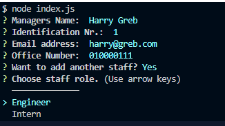

# Team Profile Generator
  # <Your-Project-Title>

  ## Description
  
  - As a manager a user want to generate a webpage that displays his team's basic info;;
  - Doing so, a user have quick access to their emails and GitHub profiles.;

  ## Table of Contents (Optional)
    
  - [Installation](#installation)
  - [Usage](#usage)
  - [License](#license)
  - [Credits](#credits)
  - [Contributing](#contributing)
  - [Tests](#tests)
  

  ## Installation
  
  npm i
  

  ## Usage
  
Run on Integrated Terminal > node index.js
  
 

 Make sure Office Number and email is added with the correct format 

 

 Open .output/team.html

 
  
  
  
  ## License
  
  Unlicenced  

  ## Credits
  
  n/a

  
  ---
  
  🏆

  ## Tests
  
  npm test

  ## Questions
  For additional questions please reach me on 
  - Email: bulazhi@gmail.com.
  - GitHub: DecoMacie.

